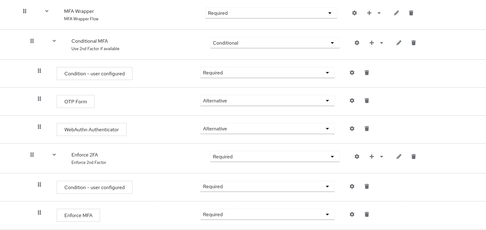

# Enforce MFA Authenticator

Implementation of an MFA enforcement authenticator. After successful setup like described below the authenticator detects
user with no second factor enabled and allows to choose a MFA method available in the current flow.

This implementation should not be confused with the ability to choose default MFA credentials, a feature which must be
supported by the account console. For further information see https://github.com/keycloak/keycloak/issues/14340

## Scope of this authenticator

This authenticator is an intermediate solution until keycloak can support flow configuration like the following:

```
- 2ndlevel-subflow REQUIRED
-- OTP ALTERNATIVE
-- WebAuthn ALTERNATIVE
```

The expected behaviour is, that the user either authenticates by one of the listed authenticators or chooses to set up
one of them.
Actual behaviour is an authentication flow exception, when no MFA method is available.

See: https://github.com/keycloak/keycloak/discussions/19548

## How to use this authenticator

This authenticator **must always** be used with an authentication flow like the following:

```
- MFA Wrapper Flow
-- MFA-Authenticate-subflow CONDITIONAL
--- Condition - user configured REQUIRED
--- OTP ALTERNATIVE
--- WebAuthn ALTERNATIVE

-- Register-MFA-subflow CONDITIONAL
--- Condition - user configured REQUIRED
--- Enforce-MFA REQUIRED
```

The expected flow must contain at least two subflows. The subflow, which contains the alternatives for MFA
**must be the first subflow in its wrapper flow**.

Example:



## Conditional Enforce MFA (`conditional-enforce-mfa`) and MFA credential condition (`mfa-credential-condition`)

The same JAR also registers:

- **`conditional-enforce-mfa`**: same login form as **Enforce MFA** (`enforce-mfa.ftl`). Offered methods are taken only from authenticator config (`offeredRequiredActions`). Optional skip: **`mfaSetupOptional`** (same key as Enforce MFA).
- **`mfa-credential-condition`**: conditional on credentials already enrolled (`credentialTypes`, combine **ALL** / **ANY**, optional **invertMatch**).

Simple example (excerpt of a browser flow):

```
- Register MFA (subflow CONDITIONAL)
-- Condition - MFA credentials (enrolled) REQUIRED   [invertMatch: true, types e.g. otp + webauthn, combine ANY]
-- Conditional Enforce MFA (config lists) REQUIRED   [offered: CONFIGURE_TOTP, webauthn-register]
```

Here the condition can send users into the subflow when MFA is still missing; **Conditional Enforce MFA** then lets them pick one configured method until at least one offered enrollment is satisfied.
